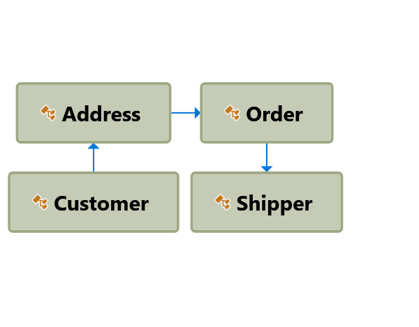

This demo is based on http://mikhail.io/2016/01/monads-explained-in-csharp/

It demonstrates how to implement the Maybe monad in C#.

## Domain

Customer --(has)--> Address --(has)--> Order --(has)--> Shipper
